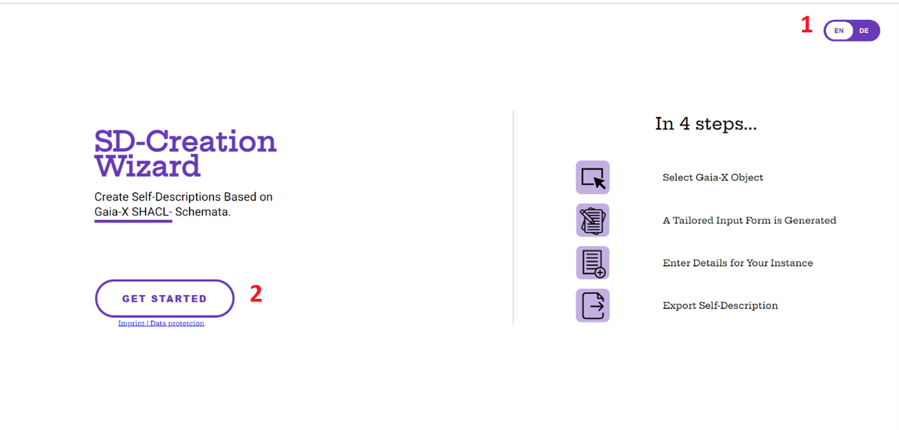
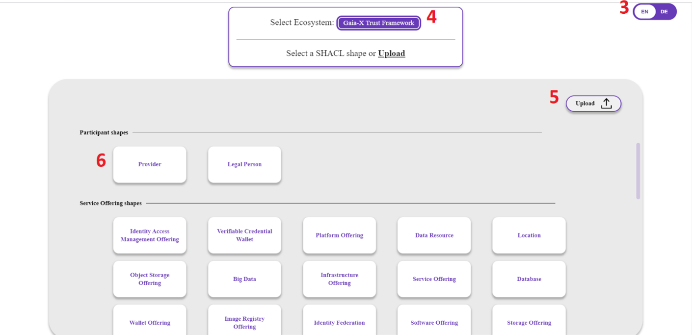
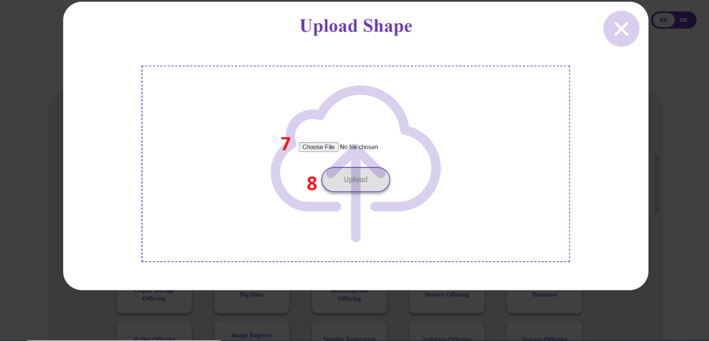
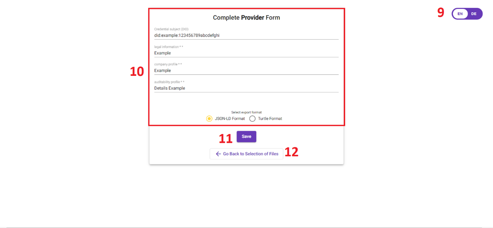

# Gaia-X Ecosystem

The Gaia-X Framework provides specifications and Open Source Software addressing the key building blocks to create data and infrastructure ecosystems.

The Gaia-X Architecture enables data - infrastructure ecosystems using the following elements: 
1)  [Gaia-X Conceptual Model](https://gaia-x.gitlab.io/technical-committee/architecture-document/conceptual_model/)
2)  [Gaia-X Operational Model] (https://gaia-x.gitlab.io/technical-committee/architecture-document/operating_model/)
3)  [Federation Services ](https://gaia-x.gitlab.io/technical-committee/architecture-document/conceptual_model/#federation-services)
4)  [Gaia-X Trust Framework](https://gaia-x.gitlab.io/technical-committee/architecture-document/operating_model/#gaia-x-trust-framework)

You can read more [here](https://gaia-x.gitlab.io/technical-committee/architecture-document/ecosystem/). 


# SD Creation Wizard

The SD Creation Wizard is developed to assist in creating [ Gaia-X Self-Descriptions](https://gaia-x.gitlab.io/technical-committee/architecture-document//self-description/)based on ontologies and SHACL shapes. Self-Descriptions describe Entities from the Gaia-X Conceptual Model in a machine interpretable format.


### Example usage (screenshots) and Static UI decomposition
The following pictures demonstrate how the system can be used, the possible actions of the system are demonstrated in the red colored numbers.
#### Home Page 

1)	Using this Button you can select the systems Language (English/German)
2)	Click on  ‘Get Started’ to access the page that allows you to create Self Descriptions 
#### Select Shape Page

3)	The language can also be changed from this page

There are two possible flows to proceed with creating a self-description either by:
a)	Using a pre-defined Gaia-X SHACL- Schemata

    4) You can choose between the shape’s Ecosystem (Gaia-X Trust Framework/Trusted Cloud)

    6) Select the desired shape
b)	Uploading your own SHACL- Schemata

    5) This button allows you to upload your own SHACL Schema

#### Upload shape Page


7) Click on Choose File to select your own schema

8) Your selected file name should appear above the button, afterwards click the upload button

#### Complete Form Page


The language can also be changed from this page

10)  Fill out the fields (Required fields are demonstrated with an *)

11) Save/Export the generated Self-Description

12) You can return to the previous select shapes page


Example shape file for uploading:
```
@prefix dcat: <http://www.w3.org/ns/dcat#> .
@prefix dct: <http://purl.org/dc/terms/> .
@prefix sh: <http://www.w3.org/ns/shacl#> .
@prefix xsd: <http://www.w3.org/2001/XMLSchema#> .
@prefix ex: <http://example.com/ns#> .

ex:DatasetShape
    a sh:NodeShape ;
    sh:targetClass dcat:Dataset ;
    sh:property [
        sh:path dct:title ;
        sh:datatype xsd:string ;
        sh:name "Dataset title" ;
        sh:description "A free-text account of the item." ;
        sh:minCount 1 ;
        sh:maxCount 1;
		sh:order 1;
		sh:minLength 5;
		sh:maxLength 20;
    ] ;
    sh:property [
        sh:path dct:description ;
        sh:datatype xsd:string ;
        sh:name "Description" ;
		sh:maxCount 1;
		sh:order 2;
    ] ;
    sh:property [
        sh:path dcat:startDate ;
        sh:datatype xsd:dateTime ;
        sh:name "Start date of the data" ;
        sh:maxCount 1;
		sh:order 3;
    ] ;
    sh:property [
        sh:path dcat:endDate ;
        sh:datatype xsd:dateTime ;
        sh:name "End date of the data" ;
        sh:maxCount 1;
		sh:order 4;
    ] ;
    sh:property [
        sh:path dcat:keyword ;
        sh:datatype xsd:string ;
		sh:order 5;
    ] ;
	.
```
Exported TTL:
```
@prefix xsd: <http://www.w3.org/2001/XMLSchema#>.
@prefix ex: <http://example.com/ns#>.
@prefix dct: <http://purl.org/dc/terms/>.
@prefix dcat: <http://www.w3.org/ns/dcat#>.
@prefix sh: <http://www.w3.org/ns/shacl#>.

<http://example.org/xm2ghy2bbxo1t80htxogq8> a dcat:Dataset;
    dct:title "My room temperature"^^xsd:string;
    dct:description "Temperature in my room measured in Celsius."^^xsd:string;
    dcat:startDate "06/15/2021"^^xsd:dateTime;
    dcat:endDate "10/14/2021"^^xsd:dateTime;
    dcat:keyword "home office"^^xsd:string, "temperature"^^xsd:string.
```

## Development
The project is based on angular and Node, before cloning the repository make sure you have the following prerequists:

### Prerequisits for local development

* Npm: npm install -g npm
* Angular: npm install -g @angular/cli

### Commands to run Docker Image

1. `docker login to_be_changed:4567`
2. `docker pull to_be_changed:latest`
3. `docker pull to_be_changed2:latest`
3. `docker-compose up` (adjust the ports if required)
4. Use your web browser to browse to http://localhost/
